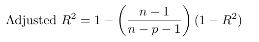

# Bai 1

```{r}
x = c(3.6, 3.5, 2.9, 1.8, 3.4, 2.3, 3.6, 3.7, 1.6, 2.0)
y = c(9.6, 9.4, 8.0, 7.3, 9.2, 6.5, 9.6, 6.9, 7.8, 6.8)


```

```{r}
y_mean = mean(y)
x_mean = mean(x)
B1 = cov(x, y) / var(x)
B0 = y_mean - x_mean * B1

print(B1)
print(B0)
```

```{r}
model = lm(y~x, data=data.frame(x, y))
summary(model)
```

```{r}
confint(model, level=0.95)
```

# Bai 2

```{r}
n = 32
mean_x = 3.7
mean_y = 4.75

B0 = 9.2928
B1 = -1.2269

R_sq = 0.6307


```

```{r}
SSE = 60.977
SST = SSE / (1-R_sq)
SSR = SST-SSE
print(SST)
print(SSR)
```

```{r}
MSR = SSR / 1
MSE = SSE / (n - 2)
F_ = MSR / MSE
print(MSR)
print(MSE)
print(F_)
```

```{r}
var_res = MSE
```

```{r}
x_i = 5
y_pred = B0 + B1 * x_i
Sxx = 69.18
range_ = sqrt(MSE*(1 + 1/n + (x_i - mean_x)^2/Sxx))
t_value = 1.812

l_range = t_value - range_
u_range = t_value + range_

print(l_range)
print(u_range)
```

n thay doi =\> mean_x, Sxx, MSE thay doi

# Bai 3

res = y - y_pred

Khi chuẩn hoá (chia cho độ lệch chuẩn), các phần dư trở nên không còn đơn vị và có thang đo đồng nhất → dễ so sánh, dễ nhận ra phần dư nào "lạ" hay "bất thường".

Giai thich code:

-   tao mo hinh HQTT don

-   Lay ra R standard cua mo hinh

-   Lay ra y_pred tu mo hinh

-   ve x va y du doan theo R standard

-   So sanh R standard voi phan phoi chuan

Giai thich hinh:

-   Phan du chuan hoa voi bien x, phan du va bien x ko co moi quan he doc lap tuyen tinh

-   Phan du chuan hoa voi bien y du doan, co moi quan he tuyen tinh giua phan du va bien y

-   phan du voi duong phan phoi chuan, phan du kha gan voi duong qqline =\> Phan phoi chuan

# Bai 5

```{r}
d = 11
SST = 15890
SSE = 318
n = 16 * 9

SSR = SST - SSE

MSR = SSR / d
MSE = SSE / (n-d-1)

F_ = MSR/MSE


print(c(SSR, MSR, MSE, F_))
```



Điều chỉnh hệ số xác định để loại bỏ sự ảnh hưởng của số lượng biến giải thích, tạo ra ước lượng khách quan hơn.
