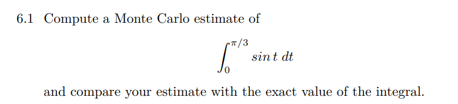
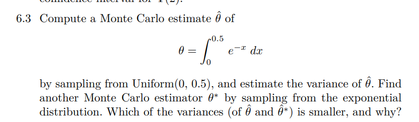

# Monte carlos estimate

### Estimate standard error

```{r}
num_sim = 1000

errors = vector(length=num_sim) # Vector to store standard errors
# errors[5]=5

for (i in 1:num_sim) {
    sd = rnorm(n=2) # generate 2 random values
    errors[i] = abs(sd[1] - sd[2])
}

estimate_error = mean(errors)
estimate_error

```

### Estimate variance of errors

```{r}
square_errors = (errors - estimate_error)^2 # Calculate square errors
estimate_var_errors = sqrt(sum(square_errors)) / num_sim
estimate_var_errors
```

### Estimate confidence level

mean = 0, sd = 2, n = 20, m = 1000 reps, alpha = 0.05 estimate sd\^2 (var) = 4

```{r}
mu = 0
sd = 2
n = 20
m = 1000
alpha = 0.05

ucl_vector = vector(length=m)
for (i in 1:m) {
    samples = rnorm(n, mu, sd)
    ucl = (n-1)*var(samples)/qchisq(alpha, df=n-1)
    ucl_vector[i] = ucl
    
}
sum(ucl_vector > 4)/m


```



```{r}
m = 10000
f = function(x) {
    return (sin(x))
}

u = pi/3
l = 0

x = runif(m)
mean_f = mean(f(x))
estimated = (u-l)*mean_f
truth_value = integrate(f, lower=l, upper=u)$value

c(truth_value, estimated)
# estimated
```



```{r}
f = function(x) {
    return (exp(-x))
}

# cdf = function(x) {
#     res = integrate(f, 0, x)$value
#     return (res)
# }

m = 10000
n = 1000
estimates = replicate(m, expr={
    u = runif(n, 0, 0.5)
    res = (0.5 - 0)*mean(f(u))
    return (res)
})

mean(estimates)
var_theta1 = var(estimates)
```

```{r}
estimates2 = replicate(m, expr={
    x = rexp(n, rate=0.5)
    return (0.5*mean(x))
})

mean(estimates2)
var_theta2 = var(estimates2)
```

```{r}
var_theta1/var_theta2
```


```{r}
f = function(x) {
    return (x * exp(-x))
}

l = 98
u = 100
n = 10000

samples = runif(n, 98, 100)
estimate = (u-l)*mean(f(samples))
truth = integrate(f, l, u)

truth
estimate
```
