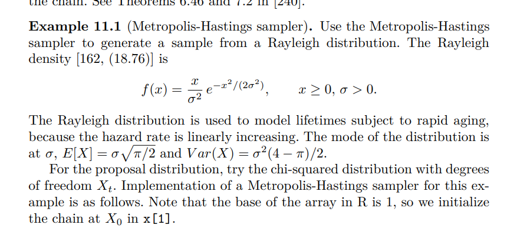
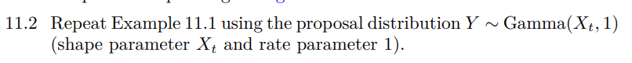

```{r}
f = function(x, sigma) { #target function
    func = (x/sigma^2) * exp(-x^2 / (2*sigma^2))
    return (func)
}

# f <- function(x, sigma) {
#   return((x/sigma^2) * exp(-x^2/(2 * sigma^2)))
# }

m = 10000 # Length of samples
sigma = 2 # Sigma parameter (random)
u = runif(m) # Generate uniform randoms

x = vector(length=m)

x[1] = rchisq(1, df=1) # Init 1st value

k=0
for (i in 2:m) {
    xt = x[i - 1] # f(x)
    y = rchisq(1, df=xt)
    
    num = f(y, sigma) * dchisq(xt, df=y)
    den = f(xt, sigma) * dchisq(y,df=xt)
    
    alpha = num/den
    
    if (u[i] <= alpha) {
        x[i] = y
    } else {
        x[i] = xt
        k = k + 1
    }
}

k
```

```{r}
# par(mfrow = c(1, 1))
plot(1000:1050, x[1000:1050], type="l", xlab="index", ylab="value")
```



```{r}
m = 10000
sigma = 4

u = runif(m)

x = vector(length=m)
x[1] = rgamma(1, shape=1)
k = 0

for (i in 2:m) {
    xt = x[i - 1]
    y = rgamma(1, shape=xt)
    
    num = f(y, sigma) * dgamma(xt, shape=y)
    den = f(xt, sigma) * dgamma(y, shape=xt)
    
    alpha = num/den
    
    if (alpha >= u[i]) {
        x[i] = y
    } else {
        x[i] = xt
        k = k + 1
    }
}

# print(k)
k

```

```{r}
plot(1000:1050, x[1000:1050], type="l")
```
