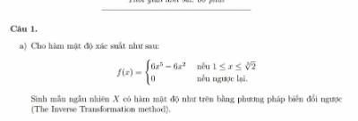

## Generate a vector of n random number in uniform distribution

```{r}
runif(n=10, min=1, max=19)
```

## sample from a given data

```{r}
sample(0:2, size=10, replace=TRUE)
```

-   sample with replace = FALSE (there is no dupplicate value) require sample data \> size

```{r}
sample(0:10, size=5, replace=FALSE)
```

## sample from multinomial distribution

```{r}
sample(1:3, size=10, replace=TRUE, prob=c(0.2, 0.3, 0.9))
```

# Inverse transform method

Example 3.2 (Inverse transform method, continuous case). This example uses the inverse transform method to simulate a random sample from the distribution with density fX(x) = 3x\^2, 0 \< x \< 1.

FX(x) = x\^3 for 0 \< x \< 1, and F_inv(u) = u\^(1/3).

Generate all n required random uniform numbers as vector u. Then u\^(1/3) is a vector of length n containing the sample x1, . . . , xn.

```{r}
f = function(x) {
    return (3*x^2)
}

F_cdf = function(x) { # Integrate the f(x)
    return (x^3)
}

F_inv = function(u) { # Find u, F_cdf = u
    return (u^(1/3))
}


n = 1000
U = runif(n)
X = F_inv(U)

hist(X, prob=TRUE)
mean(X)
```

## method 2

```{r}

cdf = function(x) {
    return (integrate(f, lower=0, upper=x)$value)
}

res = replicate(1000, expr={
    temp = runif(1)
    uniroot(function(x) {
        cdf(x) - temp
    }, interval=c(-1, 1))$root
})

mean(res)
hist(res, prob=TRUE)
```

------------------------------------------------------------------------

{width="694"}

## method 1

```{r}
f = function(x) {
    # if (x<1 | x>sqrt(2)) {
    #     return(0)
    #
    return(ifelse(x>=1|x<=2^(1/3), 6*x^5 - 6*x^2, 0))
}

cdf = function(x) {
    return (integrate(f, 1, x)$value)
}

n = 1000

res = vector(length=n)
for (i in 1:n) {
    u = runif(1)
    res[i] = uniroot(function(x) {
        cdf(x) - u
    }, interval=c(1, 2^(1/3)))$root
}

# mean(res)
hist(res, prob=TRUE)
curve(f(x), add=TRUE)
```

```{r}
f = function(x) {
    return((1/sqrt(2*pi)) * exp(-x^2/2))
}

cdf = function(x) {
    return (integrate(f, -Inf, x)$value)
}

n = 1000
res = vector(length=n)
for (i in 1:n) {
    u = runif(1)
    res[i] = uniroot(function(x) {
        cdf(x) - u
    }, interval=c(-5, 5))$root
}

hist(res, prob=TRUE)
curve(f(x), add=TRUE)
```
